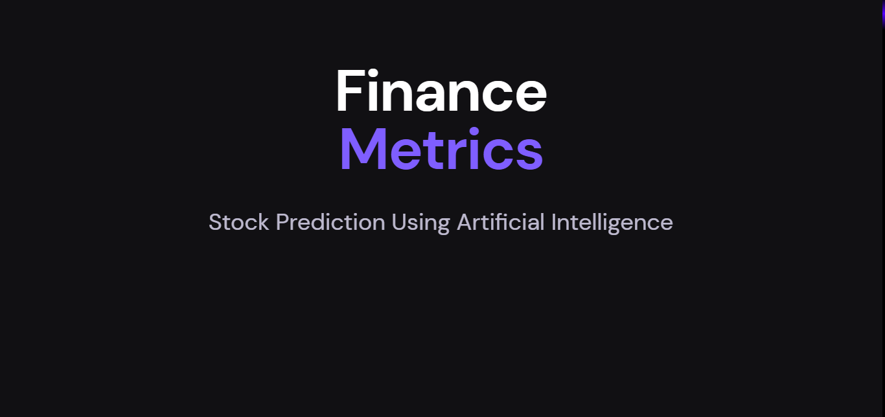
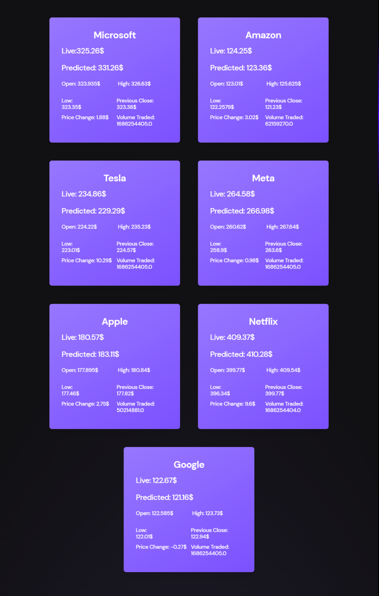
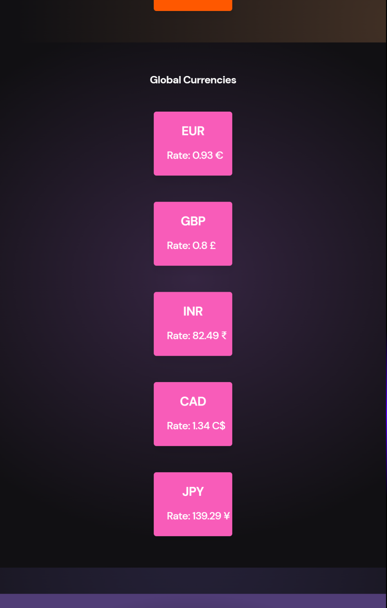
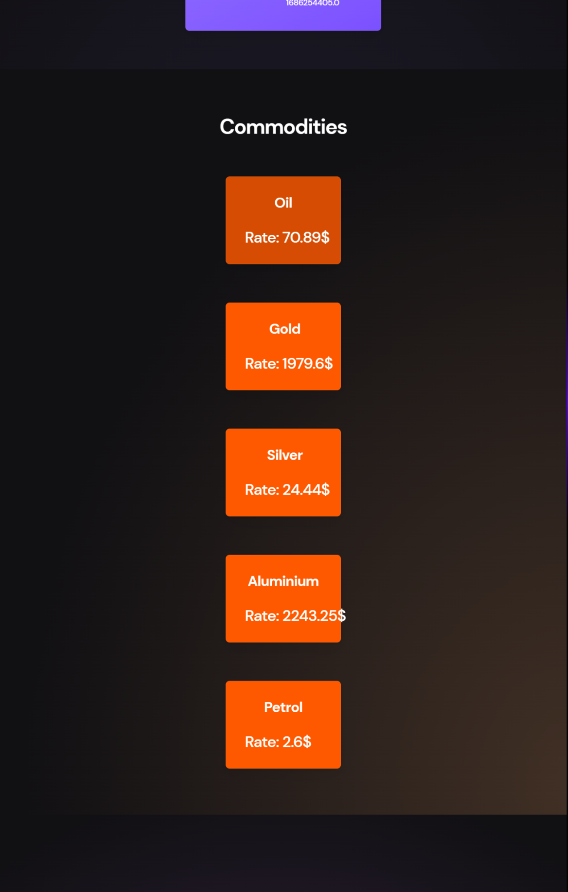
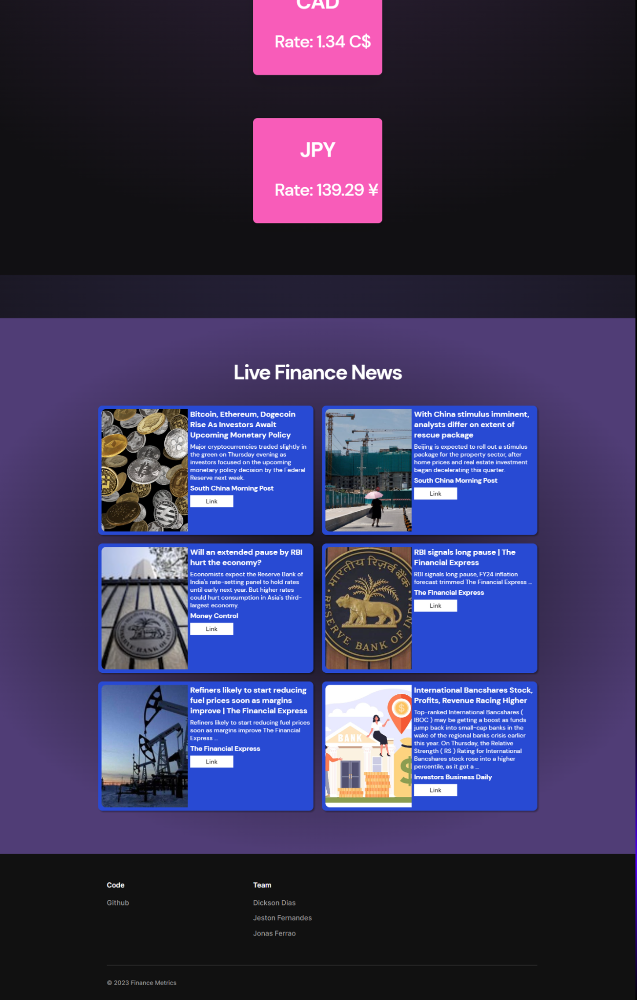

# Stock Prediction Web Application

This is a web application built with Django that fetches live stock data, processes the data, and predicts stock prices using a TensorFlow Keras model.

## Description

The Stock Prediction Web Application allows users to access real-time stock data and obtain predictions for specific stocks. The application fetches live stock data from an API, preprocesses the data, and utilizes a trained TensorFlow Keras model to make predictions. The predicted stock prices are then displayed to the user on a webpage.

## Features

- Fetches live stock data from an API
- Preprocesses the data for model input
- Imports a trained TensorFlow Keras model for stock price prediction
- Displays predicted stock prices on a webpage







## Technologies Used

- Python
- Django
- TensorFlow
- Keras
- HTML/CSS

## Setup and Installation

Local Installation

1. Clone the repository:

```sh {"id":"01HH44NH0GCR6Z704TDQPT0E35"}
git clone https://github.com/projectultra/Finance_Metrics.git

```

2. Install the required dependencies:

```sh {"id":"01HH44NH0GCR6Z704TDV2TXBGZ"}
pip install -r requirements.txt

```

3. Configure the application:

   - Update the API credentials to fetch live stock data.

4. Start the Django development server:

```sh {"id":"01HH44NH0GCR6Z704TDY7ZARCQ"}
python manage.py runserver

```

5. Access the web application:

   - Open your web browser and visit `http://localhost:8000` to access the Stock Prediction Web Application.

## Contributing

Contributions are welcome! If you find any issues or have suggestions for improvement, please feel free to contribute to this project. Just follow these steps:

1. Fork the repository.
2. Create a new branch.
3. Make your modifications.
4. Submit a pull request.

## Authors

- [Jonas Ferrao](https://github.com/projectultra)
